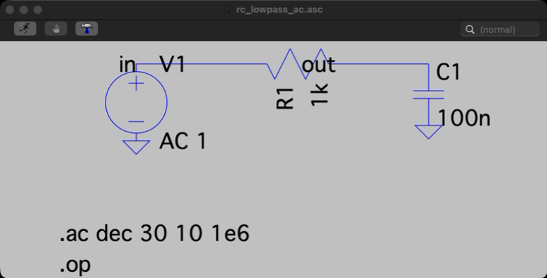
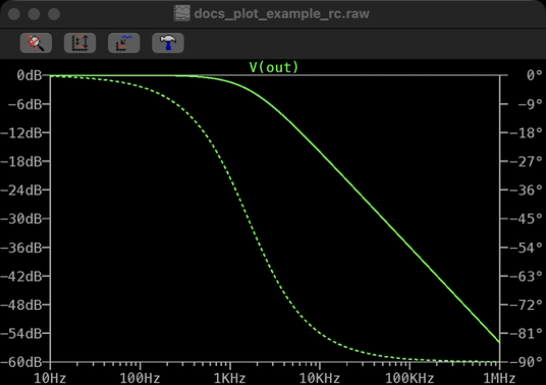

# LTspice MCP Docs

This page is the fast entry point for new users.

## Start Here

1. Install and run the server using the root [README](../README.md).
2. Point your MCP client to `http://127.0.0.1:8765/mcp`.
3. Run the first 3 tool calls below.

## First 3 MCP Tool Calls

These three calls validate the full chain: LTspice binary, simulation, and data access.

### 1) Check server and LTspice status

```json
{
  "tool": "getLtspiceStatus",
  "arguments": {}
}
```

What to check:
- `ltspice_available` is `true`
- `transport` and `workdir` are what you expect

### 2) Run a minimal RC low-pass simulation

```json
{
  "tool": "simulateNetlist",
  "arguments": {
    "circuit_name": "docs_rc_smoke",
    "netlist_content": "* RC low-pass\nV1 in 0 AC 1\nR1 in out 1k\nC1 out 0 100n\n.ac dec 30 10 1e6\n.end"
  }
}
```

What to check:
- `succeeded` is `true`
- `run_id` is present

### 3) Inspect vectors from that run

```json
{
  "tool": "getVectorsInfo",
  "arguments": {
    "run_id": "<run_id_from_previous_call>"
  }
}
```

What to check:
- vectors include `V(out)`
- step metadata is present when expected

## Visual Examples

### Schematic render



### Plot render



### Symbol render


## Recommended Next Calls

- `renderLtspiceSchematicImage`
- `renderLtspicePlotImage`
- `runMeasAutomation`
- `runVerificationPlan`
- `runSweepStudy`

## Troubleshooting

- See [AGENT_README.md](../AGENT_README.md) for diagnostic flow.
- Use `tailDaemonLog`, `getRecentErrors`, and `daemonDoctor` early.
- Ensure macOS Screen Recording + Accessibility permissions are granted.
